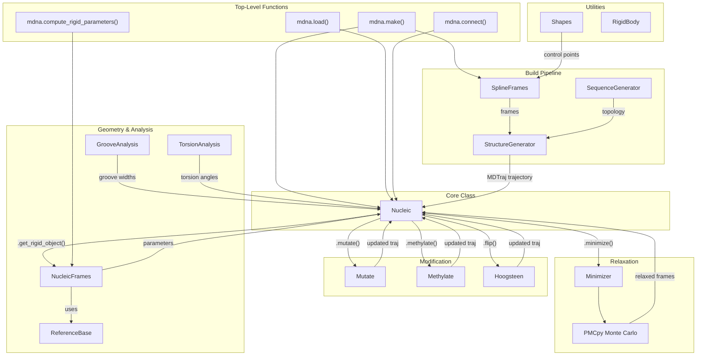
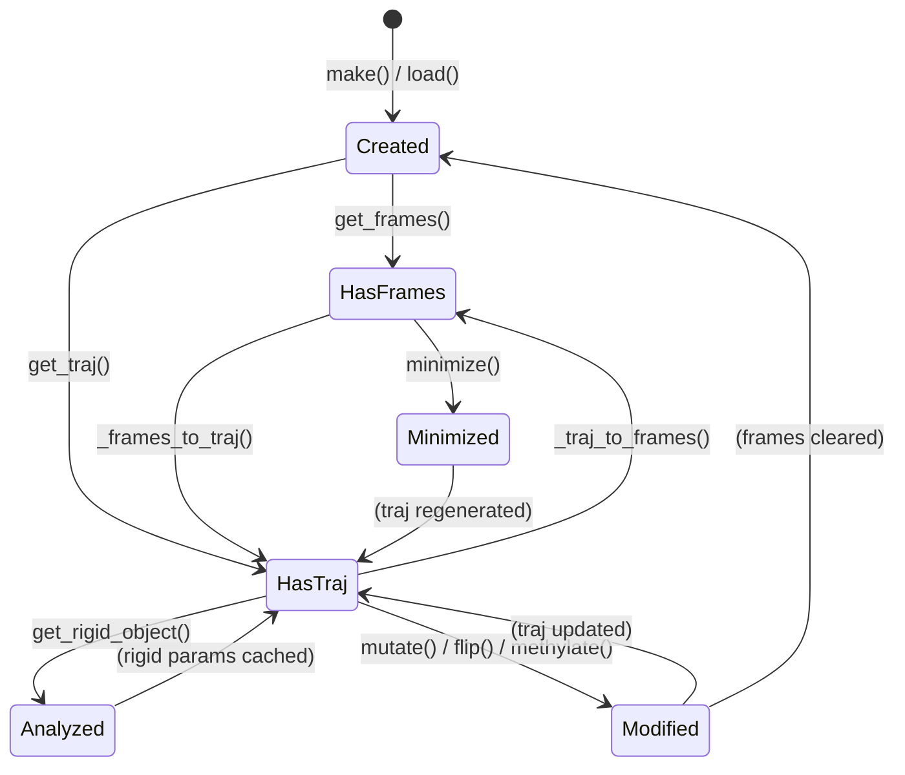

# Architecture & How MDNA Works

This page explains how MDNA's classes and functions relate to each other, and describes the internal pipeline from input to atomic-resolution output.

---

## Class Relationship Diagram

---

## The Build Pipeline

When you call `mdna.make(sequence, control_points)`, the following happens internally:

### 1. Shape → Spline Frames

The **`SplineFrames`** class takes control points (from `Shapes` or user-defined) and:

- Fits a B-spline through the points
- Distributes base pair origins along the spline at 0.34 nm spacing
- Computes orthonormal reference frames at each position using the Bishop frame method (minimal torsion)
- Applies DNA twist based on `bp_per_turn` (default 10.5) or a specified linking number difference `dLk`

**Output:** An array of frames with shape `(n_bp, 4, 3)` — origin + 3 basis vectors per base pair.

### 2. Sequence → Topology

The **`SequenceGenerator`** class:

- Loads reference base atom coordinates from the atomic library (`mdna/atomic/bases/`)
- Constructs the sense strand and complementary antisense strand
- Builds an MDTraj `Topology` with proper residue names, bonds, and chain assignments

### 3. Frames + Topology → Trajectory

The **`StructureGenerator`** class:

- Places each reference base into its corresponding frame using rigid body transformations
- Handles purine/pyrimidine placement geometry via the **`ReferenceBase`** class
- Produces a full atomic-resolution MDTraj `Trajectory`

### 4. Assembly → Nucleic

The **`Nucleic`** class wraps everything into a single object holding:

- `sequence` — the DNA sequence string
- `frames` — reference frames array `(n_bp, n_timesteps, 4, 3)`
- `traj` — the MDTraj trajectory (lazy-generated when needed)
- `circular` — topology flag

---

## The Analysis Pipeline

When you call methods like `dna.get_parameters()`:

### 1. Trajectory → Base Frames

The **`NucleicFrames`** class:

- Extracts individual nucleobase atoms from the trajectory
- Fits each base to a **`ReferenceBase`** coordinate frame using the Tsukuba convention
- Computes mid-step frames (average of consecutive base pair frames)

### 2. Frames → Parameters

From the base pair and step frames, `NucleicFrames` computes:

- **Intra-base pair parameters:** Shear, Stretch, Stagger, Buckle, Propeller, Opening
- **Inter-base pair step parameters:** Shift, Slide, Rise, Tilt, Roll, Twist

These are derived from the rotation matrices and displacement vectors between frames using the **`RigidBody`** utility class (Euler vector decomposition).

---

## Modification Pipeline

Modifications operate on the MDTraj trajectory:

- **`Mutate`**: Replaces atom coordinates and topology for specified residues using reference base structures
- **`Methylate`**: Inserts a methyl carbon atom at the C5 (cytosine) or O6 (guanine) position
- **`Hoogsteen`**: Rotates the nucleobase heavy atoms around the glycosidic bond axis

All modifications clear cached frames and rigid parameters, since the atomic coordinates have changed.

---

## The Nucleic Object Lifecycle

The `Nucleic` object lazily converts between frames and trajectory as needed. Modifications clear the frame/analysis cache, and minimization updates frames then regenerates the trajectory.

---

## Key Design Decisions

1. **Lazy evaluation**: Trajectory and frames are computed on demand, not eagerly. This allows working with frames-only workflows (fast) or full atomic trajectories (when needed).

2. **In-place modification**: Methods like `mutate()`, `flip()`, `methylate()`, `minimize()`, and `extend()` modify the `Nucleic` object in-place rather than returning new objects.

3. **MDTraj interoperability**: The atomic representation is always an MDTraj `Trajectory`, ensuring compatibility with the broader MD ecosystem.

4. **Spline-based construction**: DNA shape is defined by control points → spline → frames, decoupling geometry from sequence. This enables arbitrary shapes while maintaining correct base pair spacing and twist.
