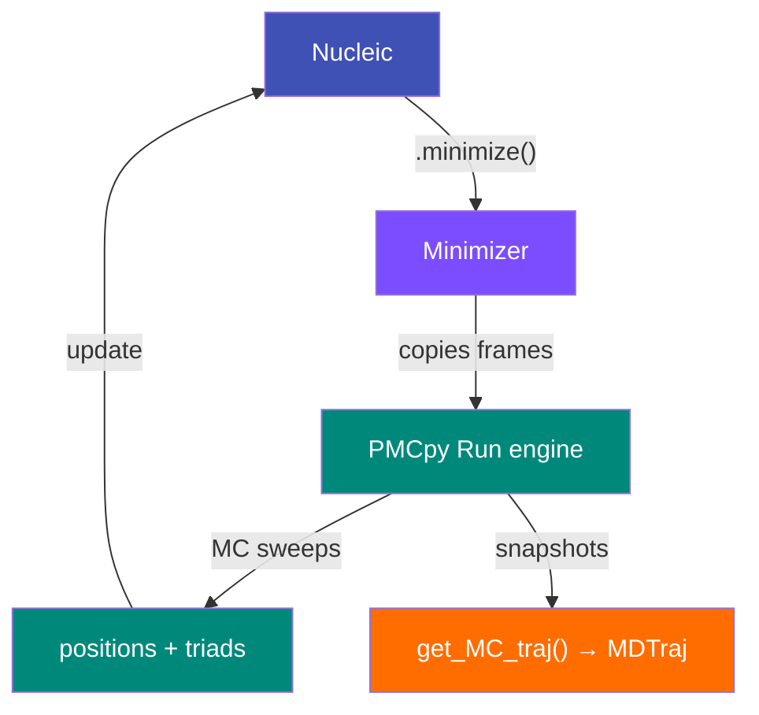

# Monte Carlo Minimization

MDNA uses Monte Carlo (MC) simulations to relax DNA structures into physically
consistent configurations.  The minimization engine is provided by **PMCpy** [github](https://github.com/eskoruppa/PMCpy/tree/405a064eec7e10c949f729c1897f4f8950930b71), a vendored subpackage located at
`mdna/PMCpy/`.

## Why Minimization?

When DNA is built from spline control points, the resulting structure captures
the desired global shape but may contain local strain — overlapping atoms,
unrealistic backbone geometries, or violated steric constraints.  MC
minimization resolves these issues by sampling thermal fluctuations around the
reference configuration while respecting an elastic energy model.

## The Rigid Base-Pair Model

PMCpy treats each base-pair step as a rigid body connected to its neighbors
through a harmonic elastic potential parameterized by the six rigid base-pair
step parameters (shift, slide, rise, tilt, roll, twist).  The stiffness
matrices are sequence-dependent and derived from atomistic MD simulations.


Each MC move proposes a small random perturbation to a base-pair step, computes
the energy change, and accepts or rejects the move using the Metropolis
criterion at the specified temperature.

## Equilibration Modes

The `minimize()` method supports three equilibration strategies:

### Full Equilibration (default)

```python
dna.minimize()
```

Runs the full PMCpy equilibration protocol.  This iteratively adjusts both the
step parameters and global configuration until convergence is reached.  The
equilibration monitors the energy trace and terminates when fluctuations
stabilize.

### Simple Equilibration

```python
dna.minimize(simple=True)
```

A lighter-weight equilibration that performs a fixed set of MC sweeps without
the adaptive convergence check.  Faster but may not fully relax highly strained
configurations.

### Writhe Equilibration

```python
dna.minimize(simple=True, equilibrate_writhe=True)
```

Special mode for **circular DNA** that additionally equilibrates the writhe
($Wr$) while maintaining the target linking number ($Lk$).  This requires the
simple equilibration path and uses the PyLk Cython extensions for efficient
writhe computation.

!!! note "Writhe equilibration requires compiled PyLk"
    See [Building PyLk Cython Extensions](../getting-started/installation.md#building-pylk-cython-extensions) for compilation instructions.

## Key Parameters

| Parameter | Default | Description |
|-----------|---------|-------------|
| `frame` | `-1` | Which stored frame to minimize (index into the frames array) |
| `exvol_rad` | `2.0` | Excluded-volume radius in nm — prevents base-pair overlap |
| `temperature` | `300` | Temperature in Kelvin for the Metropolis criterion |
| `simple` | `False` | Use simple (fixed-sweep) equilibration |
| `equilibrate_writhe` | `False` | Equilibrate writhe for circular DNA |
| `endpoints_fixed` | `True` | Keep the first and last base pairs fixed |
| `fixed` | `[]` | List of base-pair indices to keep fixed during minimization |
| `dump_every` | `20` | Save a snapshot every *n* MC sweeps |
| `plot` | `False` | Plot the energy trace during equilibration |

## Accessing the MC Trajectory

After minimization you can retrieve the full MC trajectory as an MDTraj
`Trajectory` object:

```python
dna.minimize()
traj = dna.get_MC_traj()
traj.save_pdb('mc_trajectory.pdb')
```

Each frame in the trajectory contains:

- **Argon atoms** at the base-pair center positions
- **Helium (dummy) atoms** offset along the major-groove vector

This encoding lets you visualize the MC sampling path and inspect how the
structure relaxes over the course of the simulation.

## Architecture



## See Also

- [API Reference — Minimizer](../api/minimizer.md)
- [User Guide — Building DNA](../guide/building.md) (includes minimization examples)
- [Concepts — Architecture](architecture.md) for how Minimizer fits into the overall pipeline
