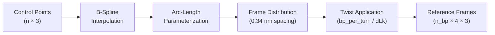

# Splines & Geometry

This page explains how MDNA uses spline interpolation to map arbitrary 3D shapes onto DNA structures.

---

## From Control Points to DNA

MDNA's construction pipeline converts a set of 3D control points into a full atomic DNA structure through spline-based frame generation.

---

## Spline Interpolation

The `SplineFrames` class uses **B-spline interpolation** (via `scipy.interpolate.splprep`) to create a smooth 3D curve through the control points.

Key parameters:

| Parameter | Default | Description |
|-----------|---------|-------------|
| `degree` | 3 | Spline degree (cubic) |
| `closed` | False | Whether the spline forms a closed loop |
| `num_points` | 1000 | Internal evaluation resolution |

For closed DNA (`circular=True`), the spline is made periodic so the curve smoothly connects back to the start.

---

## Arc-Length Parameterization

After fitting the spline, MDNA reparameterizes it by arc length. This ensures that base pair origins are distributed at **equal spacing** along the curve, regardless of how the control points are distributed.

The arc length is computed by numerical integration of the spline derivative magnitude.

---

## Frame Generation (Bishop Frames)

At each distributed point, MDNA computes an orthonormal frame (origin + 3 basis vectors) using the **Bishop frame** method:

1. **Tangent** ($\hat{T}$): First derivative of the spline (normalized)
2. **Normal** ($\hat{N}$): Derived from a reference "up" direction, orthogonalized against the tangent
3. **Binormal** ($\hat{B}$): Cross product of tangent and normal

The Bishop frame method is preferred over the Frenet-Serret frame because:

- It avoids singularities at inflection points (where curvature is zero)
- It produces **minimal torsion** — frames rotate smoothly along the curve without sudden flips
- It is well-defined even for straight segments

The initial frame orientation is propagated incrementally along the curve, ensuring continuity.

---

## Twist Application

After generating untwisted frames, DNA twist is applied:

### Default Twist

$$\theta_{\text{twist}} = \frac{360°}{\text{bp\_per\_turn}} \approx 34.3° \text{ per step}$$

with `bp_per_turn = 10.5` (canonical B-DNA).

### Linking Number Control

For circular DNA, the total twist can be modified by specifying $\Delta Lk$:

$$Lk = Tw + Wr$$

where $Tw$ is twist and $Wr$ is writhe. The `dLk` parameter adds extra twist that, after minimization, redistributes into twist and writhe according to the elastic properties of the structure.

---

## Frame Format

The output frames have shape `(n_bp, 4, 3)`:

| Row | Content | Description |
|-----|---------|-------------|
| 0 | Origin | Position of the base pair center (nm) |
| 1 | $\hat{b}_L$ | Long axis (roughly along H-bonds) |
| 2 | $\hat{b}_D$ | Short axis (in base plane) |
| 3 | $\hat{b}_N$ | Normal to the base plane |

These frames serve as the coordinate systems into which atomic base structures are placed by the `StructureGenerator`.

---

## Predefined Shapes

The `Shapes` class provides factory methods returning control point arrays:

| Shape | Method | Key Parameters |
|-------|--------|----------------|
| Straight line | `Shapes.line(length)` | `length` |
| Circle | `Shapes.circle(radius)` | `radius` |
| Helix | `Shapes.helix(...)` | `height`, `pitch`, `radius`, `num_turns` |

All return numpy arrays of shape `(n, 3)` suitable for passing to `mdna.make(control_points=...)`.

---

## Practical Tips

!!! tip "Number of control points"
    You need **at least 4 control points** for cubic spline interpolation. More points give finer control over the shape.

!!! tip "Scaling"
    When you provide both `control_points` and `n_bp` (or `sequence`), the spline is scaled so that exactly `n_bp` base pairs fit along the curve at 0.34 nm spacing.

!!! tip "Inferring n_bp"
    If you provide only `control_points` without `sequence` or `n_bp`, MDNA automatically determines the number of base pairs from the spline arc length.
