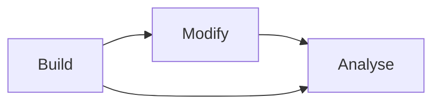

# User Guide Overview

The User Guide walks you through MDNA's three core workflows: **Build**, **Modify**, and **Analyse**.
Each section contains task-oriented examples showing how to use the toolkit in practice.

## Build

Create DNA structures from sequence, shape, or both. Generate linear strands, circular minicircles, custom-shaped DNA, and multi-segment assemblies.

[Building DNA →](building.md){ .md-button }

## Modify

Edit existing structures: mutate bases (canonical and non-canonical), add methylation, flip nucleobases into Hoogsteen configuration.

[Modifying DNA →](modifying.md){ .md-button }

## Analyse

Load MD trajectories and compute rigid base parameters, linking numbers, groove widths, and torsion angles.

[Analyzing DNA →](analyzing.md){ .md-button }

## Non-Canonical Bases

Work with fluorescent, hachimoji, and hydrophobic base pairs beyond the standard A/T/G/C alphabet.

[Non-Canonical Bases →](noncanonical.md){ .md-button }

---

## Key Entry Points

All high-level functions are available directly from `import mdna`:

| Function | Purpose |
|----------|---------|
| `mdna.make()` | Generate DNA from sequence and/or shape |
| `mdna.load()` | Load DNA from MDTraj trajectory or frames |
| `mdna.connect()` | Join two DNA structures |
| `mdna.compute_rigid_parameters()` | Compute rigid base parameters from a trajectory |
| `mdna.sequence_to_pdb()` | Generate PDB file from sequence |
| `mdna.Shapes` | Library of predefined DNA shapes |
