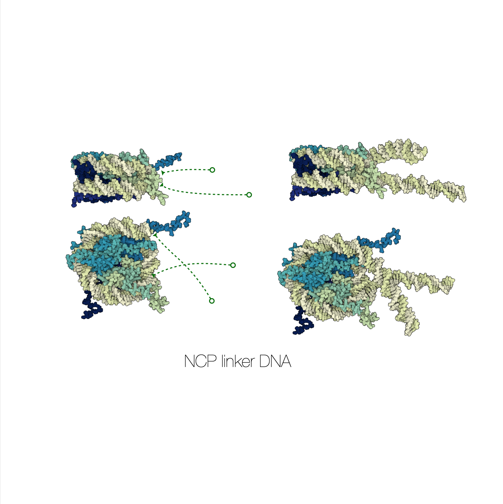
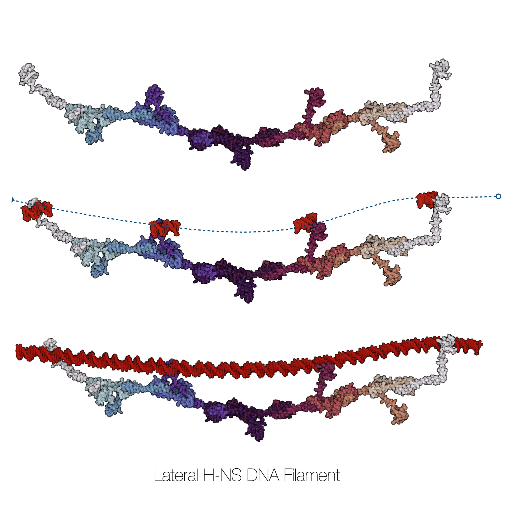

# Software module for DNA structure generation and analysis

This site contains the project documentation for the
`mdna` project that is python toolkit for the structure generation and analysis of DNA molecular dynamics simulations.
<!-- 
[Build Your Python Project Documentation With MkDocs](
    https://realpython.com/python-project-documentation-with-mkdocs/). -->

<!-- Its aim is to give you a framework to build your
project documentation using Python, MkDocs,
mkdocstrings, and the Material for MkDocs theme. -->

## Table Of Contents

<!-- The documentation follows the best practice for
project documentation as described by Daniele Procida
in the [Diátaxis documentation framework](https://diataxis.fr/)
and consists of four separate parts: -->

1. [Quick Start](tutorials/tutorials-quickstart.md)
2. [Tutorials](index-tutorials.md)
3. [Explanation](explanation/explanation.md)
4. [Jupyter Notebooks](index-notebooks.md)
5. [Modules](index-modules.md)
6. [API reference](index-api.md)

Quickly find what you're looking for depending on
your use case by looking at the different pages.

## Example Gallery
Three examples that highlight the building of biomolecular assemblies with `mdna`. Here we showcase the extension of DNA structures, using proteins as scaffold to generate DNA structure, and lastly to connect two DNA strands to form a DNA loop. Molecular representations are visualized with Mol* Viewer. 

  
  
  

<!-- ## Project Overview

::: mdna -->

## Citation

Link to the [publication](https://www.biorxiv.org/content/10.1101/2025.07.26.666940v1.abstract)

## What is MDNA?

mdna is a Python toolkit for atomic resolution generation and analysis of double stranded DNA structures. It enables the construction of arbitrarily shaped DNA using spline based mapping, supports canonical and non canonical nucleotides, and integrates Monte Carlo relaxation to obtain physically consistent configurations.

In addition to structure generation, MDNA implements rigid base parameter analysis and linking number calculations, and exports directly to MDTraj compatible trajectories for molecular dynamics workflows.

## Key Features
	•	Arbitrary DNA shape generation via spline control points
	•	Sequence driven construction with canonical and non canonical bases
	•	Hoogsteen base flipping and methylation editing
	•	Circular DNA generation with linking number control
	•	Monte Carlo based structure relaxation
	•	Native rigid base parameter analysis
	•	Intra base pair: shear, stretch, stagger, buckle, propeller, opening
	•	Inter base pair step: shift, slide, rise, tilt, roll, twist

    
## Acknowledgements

This project is supported by the NWO Klein grant.
